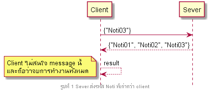
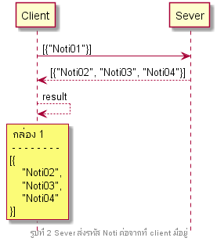

# Notifications
เมื่อระบบต้องการแจ้งอะไรก็ตามให้ผู้ใช้ application ทราบ ระบบจะส่ง Notification ไปให้ตัว client แสดงผลตามลำดับก่อนหลัง โดยการแสดงผลใน app มี2แบบดังนี้
* 1.แสดงเป็นข้อความ dialog เช่น โอนเงินสำเร็จแล้ว
* 2.ไม่แสดง dialog แต่ข้อมูลมีการเปลี่ยนแปลง เช่นยอดเงินมีการอัพเดท
## ขั้นตอนการทำงาน
ถ้า client ต้องการ sync notification client จะส่งรหัสที่บันทึกล่าสุดไปให้เซิฟเวอร์ แล้วเซิฟเวอร์จะตอบรหัสล่าสุดของเซิฟเวอร์กลับมา พร้อมรายการ message ที่ client ยังไม่เคยเห็นมาให้

1.เมื่อมี message เข้ามา ระบบจะตรวจสอบรหัสที่ส่งเข้ามา

* 1.1 ลำดับเก่ากว่า client แสดงว่าเคยเห็นข้อความนี้แล้ว ดังนั้น client ก็จะไม่สนใจ message นี้ และถือว่าจบการทำงานทั้งหมด

* 1.2 ลำดับต่อกับ client แสดงว่าเป็นข้อความถัดไปที่ client ควรจะได้รับ ดังนั้นก็เอา message นี้ไปเก็บลงกล่อง 1 แล้วทำการ Call endpoint ต่อ

* 1.3 ลำดับไม่ต่อกับ client และใหม่กว่าด้วย แสดงว่าตัว message ที่เคยส่งมามีการตกหล่น ดังนั้นตัว client ต้องไป sync message มาใหม่ทั้งหมด และทำการตรวจสอบตามขั้นตอนในข้อ 1 ใหม่

## การ Call endpoint
2.นำแต่ละตัวในกล่อง 1 ไป call endpoint ตามลำดับ โดยจะจัดการตามประเภทของ message คือ

* 2.1 ไม่ต้องรอ คือ message ที่ไม่ต้องรอให้ผู้ใช้กดอ่าน สามารถบันทึกรหัสแล้วลบทิ้งได้เลย

* 2.2 ต้องรอ(1) คือ message ที่ต้องรอให้ผู้ใช้กดอ่านก่อนถึงจะบันทึกรหัสได้ ดังนั้นย้ายไปกล่อง 2

* 2.2 ต้องรอ(2) คือ message ที่ต้องรอ message อื่นเสร็จก่อนถึงจะบันทึกได้ ดังนั้นย้ายไปกล่อง 3

***เมื่อเอาทุกตัวในกล่อง 1 ไป call endpoint หมด ระบบจะรอให้ผู้ใช้กดปิด message ถึงจะไปทำข้อ 3 ต่อ***

3.เมื่อผู้ใช้กดปิด message ระบบจะเอา endpoint ที่ถูกปิดไปเทียบกับทุกตัวในกล่อง 2

* 3.1 เป็นตัวแรกสุด แสดงว่าข้อ  message นั้นถูกอ่านแล้ว ก็สามารถบันทึกรหัสและลบออกจากกล่อง 2 ได้เลย

* 3.2 ไม่ใช่ตัวแรกสุด แสดงว่า message นั้นอาจตกหล่นด้วยสาเหตุใดก็ตาม ระบบจะย้ายไปเก็บไว้ในกล่อง 3 ก่อน

4.ถ้ากล่อง 2 ว่าง ระบบจะเอารายการใน กล่อง 3 ที่รหัสต่อเนื่องกับที่บันทึกไว้ทั้งหมดมา แล้วจะบันทึกรหัสสูงสุดไว้ แล้วลบรายการที่ดึงมาทั้งหมดทิ้ง แล้วถือว่าจบกระบวนการทั้งหมด

### สัญลักษณ์ย่อที่ใช้ในตัวอย่าง
* U คือ message ที่ไม่ต้องรอ
* R คือ message ที่ต้องรอ

## ตัวอย่างที่ 1 Client แสดงข้อความล่าสุดเป็นรหัส 0 แล้วได้รับ message เข้ามาตามรายการ

### 1.รายการที่ได้เป็นเคส **ลำดับต่อกับ client** เลยเอาทั้งหมดไปเก็บลง **กล่อง 1**

### 2.นำแต่ละตัวในกล่อง 1 ไป call endpoint ตามลำดับ
- #### 2.1 Call Endpoint **R1** ซึ่ง **ต้องรอ(1)** ดังนั้น client **ไม่บันทึกรหัสใหม่** และ **ย้ายไปอยู่กล่อง 2**

- #### 2.2 Call Endpoint **R2** ซึ่ง **ต้องรอ(1)** ดังนั้น client **ไม่บันทึกรหัสใหม่** และ **ย้ายไปอยู่กล่อง 2**

- #### 2.3 Call Endpoint **U3** ซึ่ง **ต้องรอ(2)** ดังนั้น client **ไม่บันทึกรหัสใหม่** และ **ย้ายไปอยู่กล่อง 3**

- #### **เมื่อจบขั้นตอนทั้งหมด** ข้อมูลจะเป็นตามรูปด้านล่างนี้

### 3.ระบบแสดงข้อความตามลำดับของกล่อง 2 แล้วผู้ใช้กดปิด message ตามลำดับ
- #### 3.1 กดปิด endpoint **R1** ซึ่ง **เป็นตัวแรกสุด** ดังนั้น client **บันทึกรหัสล่าสุดเป็นเลข 1** และ **ลบออกจากกล่อง 2**

- #### 3.2 กดปิด endpoint **R2** ซึ่ง **เป็นตัวแรกสุด** ดังนั้น client **บันทึกรหัสล่าสุดเป็นเลข 2** และ **ลบออกจากกล่อง 2**

- #### **เมื่อจบขั้นตอนทั้งหมด** ข้อมูลจะเป็นตามรูปด้านล่างนี้

### 4.เนื่องจากกล่อง 2 ว่าง เลยเอารายการใน **กล่อง 3 ที่รหัสต่อเนื่องกันที่บันทึกไว้มาทั้งหมด แล้วบันทึกรหัสสูงสุดไว้**

- #### **เมื่อจบขั้นตอนทั้งหมด** ข้อมูลจะเป็นตามรูปด้านล่างนี้

---------
---------
## ตัวอย่างที่ 2 Client แสดงข้อความล่าสุดเป็นรหัส 0 แล้วได้รับ message เข้ามาตามรายการ

1.รายการที่ได้เป็นเคส ลำดับต่อกับ client เลยเอาทั้งหมดไปเก็บลง กล่อง 1

2.นำแต่ละตัวในกล่อง 1 ไป call endpoint ตามลำดับ
 * 2.1 Call Endpoint U1 ซึ่งไม่ต้องรอ ดังนั้น client จะบันทึกรหัสล่าสุดเป็นเลข 1 และ ลบออกจากกล่อง1

* 2.2 Call Endpoint U2 ซึ่งไม่ต้องรอ ดังนั้น client จะบันทึกรหัสล่าสุดเป็นเลข 2 และ ลบออกจากกล่อง1

* 2.3 Call Endpoint U3 ซึ่งไม่ต้องรอ ดังนั้น client จะบันทึกรหัสล่าสุดเป็นเลข 3 และ ลบออกจากกล่อง1

3.เมื่อจบขั้นตอนทั้งหมด ข้อมูลจะเป็นตามรูปด้านล่างนี้

